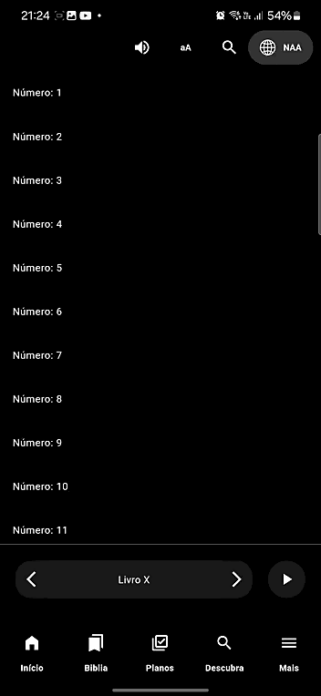
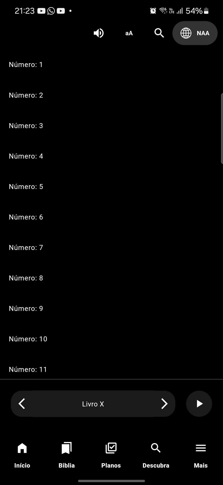
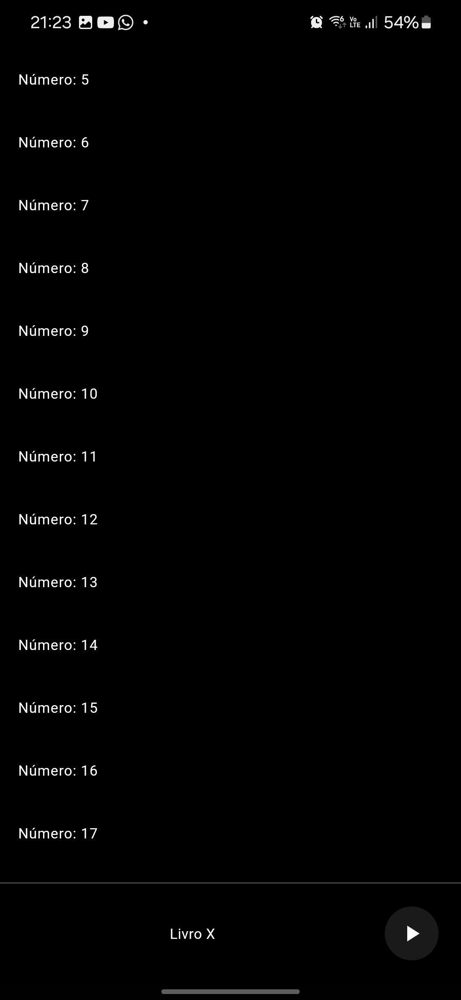

Aqui está um exemplo de como poderia ser a documentação no arquivo `README.md` para o seu projeto:

---

# Flutter Scroll Animation

Este é um projeto pessoal desenvolvido em Flutter com o objetivo de estudar e reproduzir animações dinâmicas baseadas no scroll de uma ListView. O projeto inclui animações que afetam a **AppBar** e a **BottomNavigationBar**, inspirado no comportamento encontrado no aplicativo "Bíblia Sagrada Áudio + Offline".

## 📸 Capturas de Tela
<br>

<p align="center" style="display: flex; justify-content: center; gap: 20px;">
  
  
  
</p>

## 📱 Funcionalidades

- **AppBar animada**: A AppBar altera seu estilo e comportamento conforme o usuário faz scroll na tela.
- **BottomNavigationBar animada**: O BottomNavigationBar apresenta transições visuais enquanto o conteúdo é rolado.
- **Integração com ListView**: A animação é sincronizada perfeitamente com o scroll do ListView para criar uma experiência fluida.

## 🎯 Objetivo

Este projeto foi criado com fins educacionais, para aprimorar as habilidades no desenvolvimento de animações em Flutter e compreender melhor a interação entre widgets em resposta ao scroll.

## 🛠️ Tecnologias Utilizadas

- **Flutter**: SDK de UI para desenvolvimento multiplataforma.
- **Dart**: Linguagem de programação utilizada pelo Flutter.

## 🔧 Como Executar

1. Clone o repositório:
   ```bash
   git clone https://github.com/JeffersonAntunesSampaio/flutter_scroll_animated.git
   ```
2. Navegue até o diretório do projeto:
   ```bash
   cd <DIRETORIO_DO_PROJETO>
   ```
3. Instale as dependências:
   ```bash
   flutter pub get
   ```
4. Execute o projeto:
   ```bash
   flutter run
   ```

## 🔍 Estrutura do Projeto

```
lib/
├── main.dart                       # Arquivo principal do aplicativo.
├── home_screen.dart                # Tela inicial contendo a ListView e as animações.
└── icon_button_custom.dart         # Widgets personalizados para BottomNavigationBar.
```

## 🌟 Inspiração

Este projeto foi inspirado no aplicativo **Bíblia Sagrada Áudio + Offline**, que possui animações elegantes ao scrollar a tela. A ideia principal foi recriar esse comportamento para fins de aprendizado.
[Bíblia Sagrada Áudio + Offline - Play Store](https://play.google.com/store/apps/details?id=com.sirma.mobile.bible.android&hl=pt_BR)

## 📝 Licença

Este projeto é de código aberto e está disponível sob a licença MIT. Consulte o arquivo [LICENSE](LICENSE) para mais detalhes.

---

Se precisar de alguma modificação ou adaptação no texto, é só avisar! 🚀